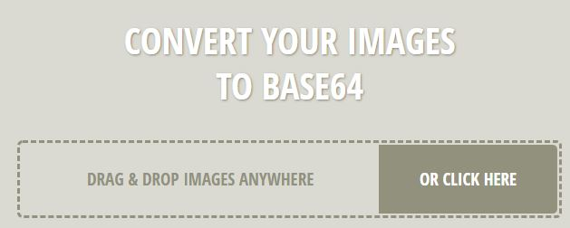
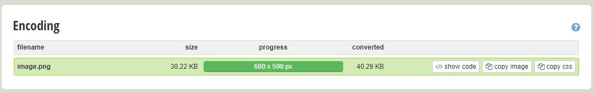
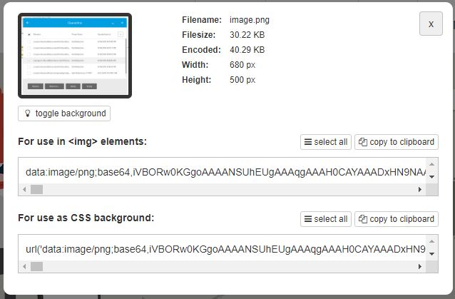

# CertificateMaker
Uses IronPDF to generate a PDF Certificate


## Creating base64 encoded images

- Goto [https://www.base64-image.de/](https://www.base64-image.de/)
- Drag image to drop area

- Wait for encoding to complete and press ```show code``` button in the **Encoding** area

- Click the ```copy to clipboard``` in the **For use in `````` elements:** area

- add and `````` to your html code and instead of a url in the src attribute paste the code copied from the step above.
